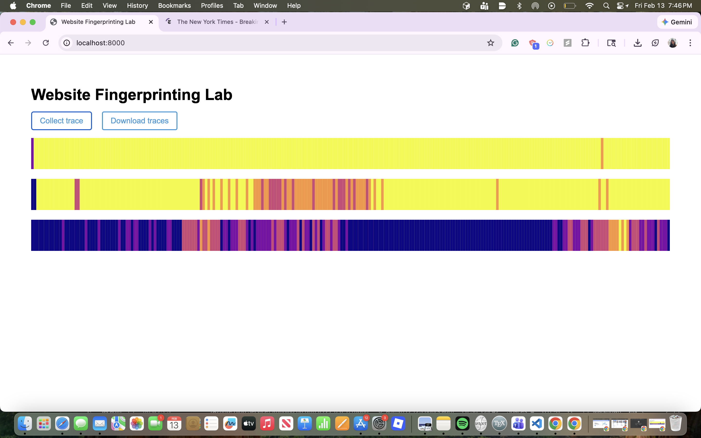

Project Team Members: Aditi Nayak, Ben Luis, Bramhi Chougule, Aidan Lee 

## Optional

**Report your browser version, CPU type, cache size, RAM amount, and OS. We use this information to learn about the attack’s behavior on different machines.**

- Browser: Google Chrome
- CPU: Apple M2
- Cache sizes: 128B
- RAM: 16 GB
- OS: macOS Sequoia Version 15.2


## 1-2

**Use the values printed on the webpage to find the median access time and report your results as follows.**

| Number of Cache Lines | Median Access Latency (ms) |
| --------------------- | -------------------------- |
| 1                     | 0                           |
| 10                    | 0                           |
| 100                   | 0                           |
| 1,000                 | 0                           |
| 10,000                | 0.04999998211860657         |
| 100,000               | 0.30000001192092896         |
| 1,000,000             | 1.300000011920929           |
| 10,000,000            | 10.450000017881393          |


## 1-3

**According to your measurement results, what is the resolution of your `performance.now()`? In order to measure differences in time with `performance.now()``, approximately how many cache accesses need to be performed?**

In order to measure differences in time with "performance now", we would need at least 10,000 cache accesses for a resoultion of ~ 0.05, and a noticiable time difference compared to previous attempts. 


## 2-2

**Report important parameters used in your attack. For each sweep operation, you access N addresses, and you count the number of sweep operations within a time interval P ms. What values of N and P do you use? How do you choose N? Why do not you choose P to be larger or smaller?**

We used N = 1,000,000 and P = 20 ms. For N we wanted each sweep to take a few tens of milliseconds so we could count a useful number of sweeps in each time window. If N was too big we got almost no sweeps per window. If it was too small the numbers were too noisy. For P we used 20 ms because a bigger P would give us fewer numbers in our trace. A smaller P would make each window so short that we’d only get 0 or 1 sweep per window, which doesn’t help. therefore 20 ms worked well.


## 2-3

**Take screenshots of the three traces generated by your attack code and include them in the lab report.**




## 2-4

**Use the Python code we provided in Part 2.1 to analyze simple statistics (mean, median, etc.) on the traces from google.com and nytimes.com. Report the statistic numbers.**
| Website                  | Mean    | Median | Standard Deviation |
|--------------------------|---------|--------|--------------------|
| Google  | 33.2778 | 37.0   | 7.1797             |
| NYtimes  | 26.6668 | 24.0   | 6.2691             |


## 2-6

**Include your classification results in your report.**

```
                          precision    recall  f1-score   support

https://www.facebook.com       0.97      0.97      0.97        33
  https://www.google.com       0.97      0.97      0.97        39
 https://www.nytimes.com       0.96      1.00      0.98        52
 https://www.youtube.com       1.00      0.94      0.97        36

                accuracy                           0.97       160
               macro avg       0.98      0.97      0.97       160
            weighted avg       0.98      0.97      0.97       160
```


## 3-2

**Include your new accuracy results for the modified attack code in your report.**

```
                          precision    recall  f1-score   support

https://www.facebook.com       0.81      0.77      0.79        44
  https://www.google.com       0.71      0.73      0.72        37
 https://www.nytimes.com       0.95      1.00      0.98        40
 https://www.youtube.com       0.92      0.90      0.91        39

                accuracy                           0.85       160
               macro avg       0.85      0.85      0.85       160
            weighted avg       0.85      0.85      0.85       160

```


## 3-3

**Compare your accuracy numbers between Part 2 and 3. Does the accuracy decrease in Part 3? Do you think that our “cache-occupancy” attack actually exploits a cache side channel? If not, take a guess as to possible root causes of the modified attack.**

In part 2, the classifier was able to achieve an overall accuracy of 97%, but in part 3 this dropped to 85% after the code attack was attacked. This is a noticeable difference, as the accuraacy dropped 12 percentage points. The modified attack performs worse at being able to distinguish between websites. However, some websites such as the NYT still maintain high precisions and recall, Facebook and Google experience a drop. 

The reduction suggests that the modified "cache-occupancy" attack may be picking up more noise than the genuine cache channel. Background programs running, timing being less precise, or CPU switching between tasks could affect the results. The lower accuracy could suggest that the modified attack is less stable and isn't able to capture the side-channel clearly. 